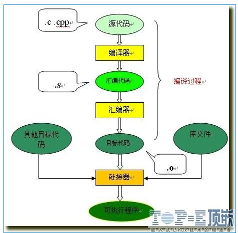
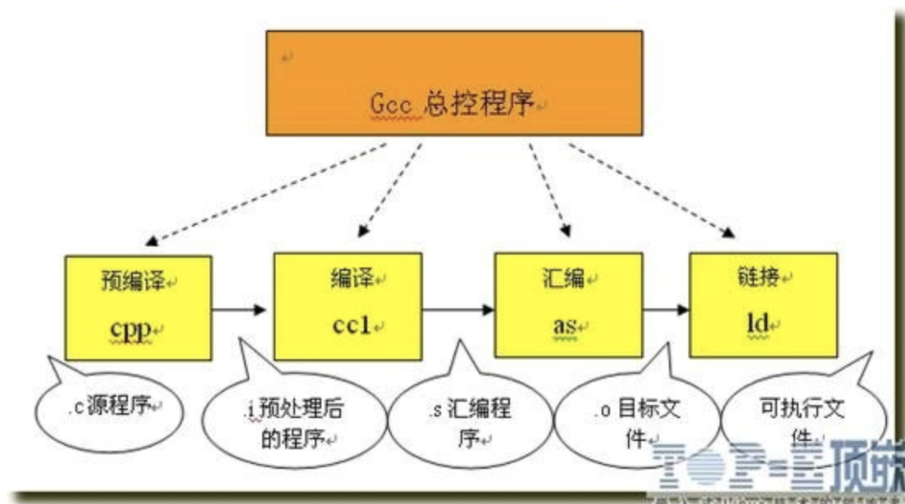

# [C/C++程序编译过程详解](http://www.cnblogs.com/mickole/articles/3659112.html)

C语言的编译链接过程要把我们编写的一个c程序（源代码）转换成可以在硬件上运行的程序（可执行代码），需要进行编译和链接。编译就是把文本形式源代码翻译为机器语言形式的目标文件的过程。链接是把目标文件、操作系统的启动代码和用到的库文件进行组织，形成最终生成可执行代码的过程。过程图解如下：



从图上可以看到，整个代码的编译过程分为编译和链接两个过程，编译对应图中的大括号括起的部分，其余则为链接过程。

### 1. 编译过程

编译过程又可以分成两个阶段：编译和汇编。

#### 编译

编译是读取源程序（字符流），对之进行词法和语法的分析，将高级语言指令转换为功能等效的汇编代码，源文件的编译过程包含两个主要阶段：

##### 编译预处理

读取c源程序，对其中的伪指令（以# 开头的指令）和特殊符号进行处理。

伪指令主要包括以下四个方面：

1) 宏定义指令，如# define Name TokenString，# undef等。

对于前一个伪指令，预编译所要做的是将程序中的所有Name用TokenString替换，但作为字符串常量的 Name则不被替换。对于后者，则将取消对某个宏的定义，使以后该串的出现不再被替换。

2) 条件编译指令，如# ifdef，# ifndef，# else，# elif，# endif等。

这些伪指令的引入使得程序员可以通过定义不同的宏来决定编译程序对哪些代码进行处理。预编译程序将根据有关的文件，将那些不必要的代码过滤掉。

3) 头文件包含指令，如# include "FileName" 或者# include < FileName> 等。

在头文件中一般用伪指令# define定义了大量的宏（最常见的是字符常量），同时包含有各种外部符号的声明。

采用头文件的目的主要是为了使某些定义可以供多个不同的C源程序使用。因为在需要用到这些定义的C源程序中，只需加上一条# include语句即可，而不必再在此文件中将这些定义重复一遍。预编译程序将把头文件中的定义统统都加入到它所产生的输出文件中，以供编译程序对之进行处理。

包含到c源程序中的头文件可以是系统提供的，这些头文件一般被放在/ usr/ include目录下。在程序中# include它们要使用尖括号（< >）。另外开发人员也可以定义自己的头文件，这些文件一般与c源程序放在同一目录下，此时在# include中要用双引号（""）。

4) 特殊符号，预编译程序可以识别一些特殊的符号。

例如在源程序中出现的LINE标识将被解释为当前行号（十进制数），FILE则被解释为当前被编译的C源程序的名称。预编译程序对于在源程序中出现的这些串将用合适的值进行替换。

预编译程序所完成的基本上是对源程序的“替代”工作。经过此种替代，生成一个没有宏定义、没有条件编译指令、没有特殊符号的输出文件。这个文件的含义同没有经过预处理的源文件是相同的，但内容有所不同。下一步，此输出文件将作为编译程序的输入而被翻译成为机器指令。

##### 编译、优化阶段

经过预编译得到的输出文件中，只有常量；如数字、字符串、变量的定义，以及C语言的关键字，如main, if , else , for , while , { , } , + , - , * , \ 等等。

编译程序所要作得工作就是通过词法分析和语法分析，在确认所有的指令都符合语法规则之后，将其翻译成等价的中间代码表示或汇编代码。

优化处理是编译系统中一项比较艰深的技术。它涉及到的问题不仅同编译技术本身有关，而且同机器的硬件环境也有很大的关系。优化一部分是对中间代码的优化。这种优化不依赖于具体的计算机。另一种优化则主要针对目标代码的生成而进行的。

对于前一种优化，主要的工作是删除公共表达式、循环优化（代码外提、强度削弱、变换循环控制条件、已知量的合并等）、复写传播，以及无用赋值的删除，等等。

后一种类型的优化同机器的硬件结构密切相关，最主要的是考虑是如何充分利用机器的各个硬件寄存器存放有关变量的值，以减少对于内存的访问次数。另外，如何根据机器硬件执行指令的特点（如流水线、RISC、CISC、VLIW等）而对指令进行一些调整使目标代码比较短，执行的效率比较高，也是一个重要的研究课题。

经过优化得到的汇编代码必须经过汇编程序的汇编转换成相应的机器指令，方可能被机器执行。

#### 汇编

汇编过程实际上指把汇编语言代码翻译成目标机器指令的过程。对于被翻译系统处理的每一个C语言源程序，都将最终经过这一处理而得到相应的目标文件。目标文件中所存放的也就是与源程序等效的目标的机器语言代码。

目标文件由段组成。通常一个目标文件中至少有两个段：

1) 代码段：该段中所包含的主要是程序的指令。该段一般是可读和可执行的，但一般却不可写。

2) 数据段：主要存放程序中要用到的各种全局变量或静态的数据。一般数据段都是可读，可写，可执行的。

UNIX环境下主要有三种类型的目标文件：

1) 可重定位文件

其中包含有适合于其它目标文件链接来创建一个可执行的或者共享的目标文件的代码和数据。

2) 共享的目标文件

这种文件存放了适合于在两种上下文里链接的代码和数据。

第一种是链接程序可把它与其它可重定位文件及共享的目标文件一起处理来创建另一个目标文件；

第二种是动态链接程序将它与另一个可执行文件及其它的共享目标文件结合到一起，创建一个进程映象。

3) 可执行文件

它包含了一个可以被操作系统创建一个进程来执行之的文件。

汇编程序生成的实际上是第一种类型的目标文件。对于后两种还需要其他的一些处理方能得到，这个就是链接程序的工作了。

### 2. 链接过程

由汇编程序生成的目标文件并不能立即就被执行，其中可能还有许多没有解决的问题。

例如，某个源文件中的函数可能引用了另一个源文件中定义的某个符号（如变量或者函数调用等）；在程序中可能调用了某个库文件中的函数，等等。所有的这些问题，都需要经链接程序的处理方能得以解决。

链接程序的主要工作就是将有关的目标文件彼此相连接，也即将在一个文件中引用的符号同该符号在另外一个文件中的定义连接起来，使得所有的这些目标文件成为一个能够被操作系统装入执行的统一整体。

根据开发人员指定的同库函数的链接方式的不同，链接处理可分为两种：

1) 静态链接

在这种链接方式下，函数的代码将从其所在的静态链接库中被拷贝到最终的可执行程序中。这样该程序在被执行时这些代码将被装入到该进程的虚拟地址空间中。静态链接库实际上是一个目标文件的集合，其中的每个文件含有库中的一个或者一组相关函数的代码。

2) 动态链接

在此种方式下，函数的代码被放到称作是动态链接库或共享对象的某个目标文件中。链接程序此时所作的只是在最终的可执行程序中记录下共享对象的名字以及其它少量的登记信息。在此可执行文件被执行时，动态链接库的全部内容将被映射到运行时相应进程的虚地址空间。动态链接程序将根据可执行程序中记录的信息找到相应的函数代码。

对于可执行文件中的函数调用，可分别采用动态链接或静态链接的方法。使用动态链接能够使最终的可执行文件比较短小，并且当共享对象被多个进程使用时能节约一些内存，因为在内存中只需要保存一份此共享对象的代码。但并不是使用动态链接就一定比使用静态链接要优越。在某些情况下动态链接可能带来一些性能上损害。

### 3. GCC的编译链接

我们在linux使用的gcc编译器便是把以上的几个过程进行捆绑，使用户只使用一次命令就把编译工作完成，这的确方便了编译工作，但对于初学者了解编译过程就很不利了，下图便是gcc代理的编译过程：

](http://images.cnitblog.com/blog/529981/201404/111709148092017.jpg

从上图可以看到：

1) 预编译

将.c 文件转化成 .i文件

使用的gcc命令是：gcc –E

对应于预处理命令cpp

2) 编译

将.c/.h文件转换成.s文件

使用的gcc命令是：gcc –S

对应于编译命令 cc –S

3) 汇编

将.s 文件转化成 .o文件

使用的gcc 命令是：gcc –c

对应于汇编命令是 as

4) 链接

将.o文件转化成可执行程序

使用的gcc 命令是： gcc

对应于链接命令是 ld

总结起来编译过程就上面的四个过程：预编译处理(.c) －－> 编译、优化程序（.s、.asm）－－> 汇编程序(.obj、.o、.a、.ko) －－> 链接程序（.exe、.elf、.axf等）。

### 4. 总结

C语言编译的整个过程是非常复杂的，里面涉及到的编译器知识、硬件知识、工具链知识都是非常多的，深入了解整个编译过程对工程师理解应用程序的编写是有很大帮助的，希望大家可以多了解一些，在遇到问题时多思考、多实践。

一般情况下，我们只需要知道分成编译和链接两个阶段，编译阶段将源程序（*.c) 转换成为目标代码（一般是obj文件，至于具体过程就是上面说的那些阶段），链接阶段是把源程序转换成的目标代码（obj文件）与你程序里面调用的库函数对应的代码连接起来形成对应的可执行文件（exe文件）就可以了，其他的都需要在实践中多多体会才能有更深的理解。

 

------

C/C++编译过程

C/C++编译过程主要分为4个过程 
1) 编译预处理 
2) 编译、优化阶段 
3) 汇编过程 
4) 链接程序

一、编译预处理

（1）宏定义指令，如#define Name TokenString，#undef等。 对于前一个伪指令，预编译所要做的是将程序中的所有Name用TokenString替换，

但作为字符串常量的 Name则不被替换。对于后者，则将取消对某个宏的定义，使以后该串的出现不再被替换。

（2）条件编译指令，如#ifdef，#ifndef，#else，#elif，#endif等。 这些伪指令的引入使得程序员可以通过定义不同的宏来决定编译程序对哪些代码进行处理。

预编译程序将根据有关的文件，将那些不必要的代码过滤掉

（3） 头文件包含指令，如#include "FileName"或者#include <FileName>等。 在头文件中一般用伪指令#define定义了大量的宏（最常见的是字符常量），

同时包含有各种外部符号的声明。 包含到c源程序中的头文件可以是系统提供的，这些头文件一般被放在/usr/include目录下。

在程序中#include它们要使用尖括号（< >）。

另外开发人员也可以定义自己的头文件，这些文件一般与c源程序放在同一目录下，此时在#include中要用双引号（""）。

（4）特殊符号，预编译程序可以识别一些特殊的符号。 例如在源程序中出现的#line标识将被解释为当前行号（十进制数）， 
上面程序实现了对宏line的运用

（5）预处理模块 预处理工作由#pragma命令完成，#Pragma命令将设定编译器的状态或者是指示编译器完成一些特定的动作。

\#pragma指令对每个编译器给出了一个方法,在保持与C和C++语言完全兼容的情况下,给出主机或操作系统专有的特征。

依据定义,编译指示是机器或操作系统专有的,且对于每个编译器都是不同的。 
打开C标准库函数，如stdio.h，我们总能找到下面这一句指示编译器初始化堆栈


```
#include "iostream"
#line 100
using namespace std;
int main(int argc, char* argv[])
{
cout<<"__LINE__:"<<__LINE__<<endl;
return 0;
}
```


/*-------------------- 
\* 输出结果为： 
\* __LINE__:103 
\* 本来输出的结果应该是 7，但是用#line指定行号之后，使下一行的行号变为, 
\* 到输出语句恰为行103 
---------------------*/ 
C/C++编译过程 
或者程序指示编译器去链接系统动态链接库或用户自定义链接库 
二、编译、优化阶段 
经过预编译得到的输出文件中，只有常量；如数字、字符串、变量的定义，以及C语言的关键字，如main,if,else,for,while,{,}, +,-,*,\等等。 
在《编译原理》中我们可以了解到一个编译器对程序代码的编译主要分为下面几个过程： 
a) 词法分析 
b) 语法分析 
c) 语义分析 
d) 中间代码生成 
e) 代码优化 
f) 代码生成 
g) 符号表管理 
h) 将多个步骤组合成趟 
i) 编译器构造工具
在这里我们主要强调对函数压栈方式（函数调用约定）的编译处理 
C与C++语言调用方式大体相同，下面是几种常用的调用方式：

__cdecl 是C DECLaration的缩写（declaration，声明），表示C语言默认的函数调用方法：所有参数从右到左依次入栈，

这些参数由调用者清除，称为手动清栈。被调用函数不需要求调用者传递多少参数，调用者传递过多或者过少的参数，

甚至完全不同的参数都不会产生编译阶段的错误。

_stdcall 是StandardCall的缩写，是C++的标准调用方式：所有参数从右到左依次入栈，如果是调用类成员的话，

最后一个入栈的是this指针。这些堆栈中的参数由被调用的函数在返回后清除，使用的指令是 retnX，X表示参数占用的字节数，

CPU在ret之后自动弹出X个字节的堆栈空间。称为自动清栈。函数在编译的时候就必须确定参数个数，

并且调用者必须严格的控制参数的生成，不能多，不能少，否则返回后会出错。

PASCAL 是Pascal语言的函数调用方式，在早期的c/c++语言中使用这种调用方式，

参数压栈顺序与前两者相反，但现在我们在程序中见到的都是它的演化版本，其实 


```
#pragma comment(lib,_T("GDI32.lib"))
#ifdef _MSC_VER
/*
* Currently, all MS C compilers for Win32 platforms default to 8 byte
* alignment.
*/
#pragma pack(push,_CRT_PACKING)
#endif /* _MSC_VER */
```


C/C++编译过程 
质是另一种调用方式 
_fastcall是编译器指定的快速调用方式。由于大多数的函数参数个数很少，使用堆栈传递比较费时。因此_fastcall通常规定将前两个（或若干个）参数由寄存器传递，其余参数还是通过堆栈传递。不同编译器编译的程序规定的寄存器不同。返回方式和_stdcall相当。 
_thiscall 是为了解决类成员调用中this指针传递而规定的。_thiscall要求把this指针放在特定寄存器中，该寄存器由编译器决定。VC使用ecx，Borland的C++编译器使用eax。返回方式和_stdcall相当。 
_fastcall 和 _thiscall涉及的寄存器由编译器决定，因此不能用作跨编译器的接口。所以Windows上的COM对象接口都定义为_stdcall调用方式。 
C中不加说明默认函数为_cdecl方式（C中也只能用这种方式），C++也一样，但是默认的调用方式可以在IDE环境中设置。简单的我们可以从printf函数看出 
printf使用从从左至右压栈，返回int型并由_CRTIMP指定封在动态链接库中。 
通过金典的hello world程序我们可以知道编译器对其argc和argv[]这两个参数进行了压栈，并且argc留在了栈顶 
优化处理是编译系统中一项比较艰深的技术。它涉及到的问题不仅同编译技术本身有关，而且同机器的硬件环境也有很大的关系。优化处理主要分为下面几个过程： 
1) 局部优化 
a) 基本块的划分 
b) 基本块的变换 
c) 基本块的DAG表示 
d) DAG的应用 
e) 构造算法讨论 
2) 控制流分析和循环优化 
a) 程序流图与循环 


```
/*金典的hello world*/
#include <stdio.h>
int main(int argc, char* argv[])
{
printf("hello world");
return 0;
}
_Check_return_opt_ _CRTIMP int __cdecl printf(_In_z_ _Printf_format_string_ const char * _Format, ...);
#define CALLBACK _stdcall /* Windows程序回调函数*/
#define WINAPI _stdcall
#define WINAPIV _cdecl
#define PASCAL _stdcall /*在c++语言中使用了StandardCall调用方式*/
#define PASCAL _cdecl/*在c语言中使用了C DECLaration调用方式*/
```


C/C++编译过程 
b) 循环 
c) 循环的查找 
d) 可归约流图 
e) 循环优化 
3) 数据流的分析与全局优化 
a) 一些主要的概念 
b) 数据流方程的一般形式 
c) 到达一定值数据流方程 
d) 可用表达式及其数据流方程 
e) 活跃变量数据流方程 
f) 复写传播
经过优化得到的汇编代码必须经过汇编程序的汇编转换成相应的机器指令，方可能被机器执行。

三、汇编过程

汇编过程实际上指把汇编语言代码翻译成目标机器指令的过程。对于被翻译系统处理的每一个C语言源程序，

都将最终经过这一处理而得到相应的目标文件。目标文件中所存放的也就是与源程序等效的目标的机器语言代码。

目标文件由段组成。通常一个目标文件中至少有两个段： 代码段：该段中所包含的主要是程序的指令。

该段一般是可读和可执行的，但一般却不可写。 数据段：主要存放程序中要用到的各种全局变量或静态的数据。一般数据段都是可读，可写，可执行的。

四、链接程序

由汇编程序生成的目标文件并不能立即就被执行，其中可能还有许多没有解决的问题。

例如，某个源文件中的函数可能引用了另一个源文件中定义的某个符号（如变量或者函数调用等）；

在程序中可能调用了某个库文件中的函数，等等。所有的这些问题，都需要经链接程序的处理方能得以解决。

链接程序的主要工作就是将有关的目标文件彼此相连接，也即将在一个文件中引用的符号同该符号在另外一个文件中的定义连接起来，

使得所有的这些目标文件成为一个能够诶操作系统装入执行的统一整体。

根据开发人员指定的同库函数的链接方式的不同，链接处理可分为两种：

（1）静态链接 在这种链接方式下，函数的代码将从其所在地静态链接库中被拷贝到最终的可执行程序中。

这样该程序在被执行时这些代码将被装入到该进程的虚拟地址空间中。静态链接库实际上是一个目标文件的集合，

其中的每个文件含有库中的一个或者一组相关函数的代码。

（2） 动态链接 
在此种方式下，函数的代码被放到称作是动态链接库或共享对象的某个目标文件中。链接程序此时所作的只是在最终的可执行程序中记录下共享对象的名字以及其它少量的登记信息。在此可执行文件被执行时，动态链接库的全部内容将被映射到运行时相应进程的虚地址空间。动态链接程序将根据可执行程序中记录的信息找到相应的函数代码。C/C++编译过程对于可执行文件中的函数调用，可分别采用动态链接或静态链接的方法。使用动态链接能够使最终的可执行文件比较短小，并且当共享对象被多个进程使用时能节约一些内存，因为在内存中只需要保存一份此共享对象的代码。但并不是使用动态链接就一定比使用静态链接要优越。在某些情况下动态链接可能带来一些性能上损害。

----------------------------------------------------作者 张彦升

转自：https://www.cnblogs.com/mickole/articles/3659112.html